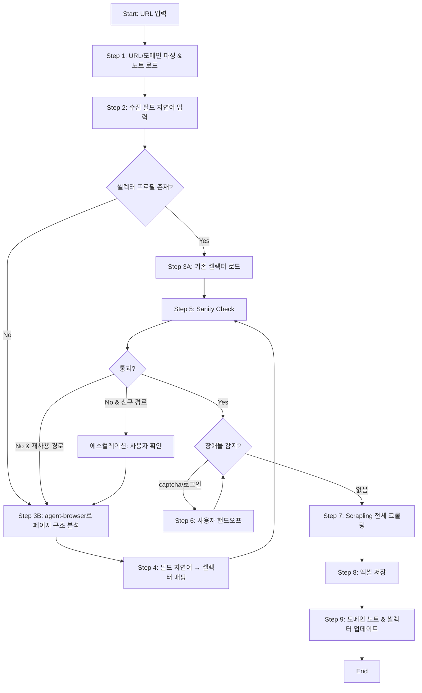

# 경쟁사 리뷰 크롤러 에이전트 시스템 설계서

> 작성일: 2026-04-21
> 목적: Claude Code 구현 참조용 계획서

---

## 1. 작업 컨텍스트

### 배경 및 목적
경쟁사 제품/서비스 리뷰를 주기적으로 수집·분석하기 위해, 사용자가 제공한 URL로부터 리뷰 데이터를 자동으로 크롤링하여 엑셀로 저장하는 에이전트가 필요하다. 사이트마다 구조가 다르고, recaptcha·로그인 같은 사람의 개입이 필요한 장애물이 있으므로 에이전트는 구조를 자동 분석하고 사용자의 자연어 요청을 필드로 매핑하며, 장애물 발생 시 사용자에게 일시적으로 제어권을 넘길 수 있어야 한다. 또한 같은 사이트를 반복 크롤링할 때 효율을 위해 도메인별 대응 전략을 누적 기록하고 재사용한다.

### 범위
- **포함**:
  - 사용자가 입력한 단일 또는 복수 URL 처리
  - agent-browser 스킬로 페이지 DOM 구조 스냅샷 분석
  - 사용자의 자연어 요청("제목, 별점, 내용 뽑아줘")을 DOM 셀렉터로 매핑
  - Scrapling 라이브러리를 사용한 실제 데이터 수집
  - 페이지네이션 전체 순회 (사용자가 페이지 수 지정 시 해당 범위까지)
  - 도메인별 output 폴더 관리 (`output/<domain>/`)
  - 도메인별 대응 노트(`_site_notes.md`) 및 셀렉터(`_selectors.json`) 누적·재사용
  - recaptcha / 로그인 등 자동화 불가 장애물 발생 시 브라우저를 띄워 사용자에게 제어권 이양 후 재개
  - 엑셀(`.xlsx`) 포맷 저장
- **제외**:
  - 리뷰 내용의 감성 분석·요약·번역 등 후처리
  - 스케줄링/크론 자동 실행 (수동 트리거만)
  - 사이트 이용약관을 위반하는 고강도 우회 기법 (robots.txt 준수, 합리적 rate limit)
  - 비디오·첨부 파일 다운로드 (URL만 기록, 바이너리 다운로드는 범위 밖)

### 입출력 정의

| 항목 | 내용 |
|------|------|
| **입력** | CLI 대화형: ① 리뷰 페이지 URL(들) ② 수집 필드 자연어 지시(예: "제목, 별점, 작성자, 내용") ③ 페이지 수 지시(생략 시 전체) |
| **출력** | `output/<도메인>/<YYYYMMDD_HHMM>_reviews.xlsx` (필드별 컬럼 + 메타 컬럼: `source_url`, `page`, `scraped_at`). 부산물: `_site_notes.md`, `_selectors.json`, `_session.json`(선택) |
| **트리거** | 사용자가 `python run.py` (또는 Claude Code 슬래시 커맨드) 실행 → URL 프롬프트 |

### 제약조건
- **기술적**:
  - Scrapling 라이브러리 사용 (`StealthyFetcher` 기본, JS 렌더링 필요 시 `PlayWrightFetcher` 폴백)
  - agent-browser 스킬은 구조 탐색·장애물 핸드오프 전용으로 사용 (대량 반복 크롤링은 Scrapling이 담당)
  - Python 3.10+, `openpyxl` 엑셀 작성 (수식 불필요, 단순 테이블)
  - 크롬/크로미움 브라우저 필요 (Playwright 설치 시 함께 설치)
- **운영**:
  - 기본 요청 간격 1~2초 (도메인별 노트에서 튜닝 가능), 병렬 요청은 기본 off
  - robots.txt 확인 후 크롤링 비허용 시 사용자에게 경고 및 확인
  - 한 번 실행에 한 도메인 기준 최대 100페이지 안전한계 (초과 시 사용자 확인)
- **품질**:
  - sanity check에서 수집 필드가 비어있는 비율이 50% 이상이면 재분석 트리거
  - 수집 로우 수가 0이면 실패로 처리, 부분 실패(< 90% 필드 채움)는 경고 로그

### 용어 정의
| 용어 | 정의 |
|------|------|
| **도메인 노트** | 특정 호스트(`example.com`)에 대한 대응 전략·주의사항을 자연어로 누적 기록한 Markdown 문서 |
| **셀렉터 프로필** | 특정 URL 패턴에 대한 CSS/XPath 셀렉터, 페이지네이션 규칙, Scrapling 옵션을 저장한 JSON |
| **핸드오프** | 자동화로 풀 수 없는 장애물(captcha, 로그인, 2FA) 감지 시 브라우저를 사용자에게 넘기고 완료 신호를 기다리는 절차 |
| **sanity check** | 결정된 셀렉터로 샘플 1~2개 리뷰를 긁어서 빈 필드 비율이 임계치 이하인지 확인하는 단계 |
| **재사용 / 재분석** | 도메인 노트의 셀렉터를 바로 쓰는 것(재사용) vs 페이지 구조를 다시 분석하여 셀렉터를 갱신하는 것(재분석) |

---

## 2. 워크플로우 정의

### 전체 흐름도



### LLM 판단 vs 코드 처리 구분

| LLM이 직접 수행 | 스크립트로 처리 |
|----------------|----------------|
| 사용자의 자연어 필드 지시를 DOM 후보 요소로 매핑 (예: "별점" → `span.rating`, `[aria-label*=star]`) | URL 파싱, 도메인 추출, 폴더/파일 경로 계산 |
| agent-browser 스냅샷에서 "리뷰 블록"에 해당하는 반복 요소 식별 | Scrapling fetch·parse·pagination 순회 |
| sanity check 실패 원인 해석("봇 차단 같음" vs "셀렉터 오류") 및 다음 행동 결정 | 셀렉터로 텍스트/속성 추출, 결과 리스트화 |
| 페이지네이션 패턴 인식 (next 버튼, 번호 링크, infinite scroll 중 어느 쪽인지) | openpyxl로 엑셀 워크북 작성, 컬럼 포매팅 |
| 장애물(captcha/로그인/2FA) 감지 및 사용자 안내 메시지 작성 | JSON·Markdown 읽기/쓰기, 쿠키 직렬화/주입 |
| 도메인 노트 업데이트 내용 작성 (무엇이 바뀌었고 왜 그런지) | robots.txt 조회, 요청 간격 스로틀링 |
| 수집이 실패했을 때 재사용 vs 재분석 판단 | 페이지네이션 URL 템플릿 전개, 중복 제거 |

### 단계별 상세

#### Step 1: URL 파싱 및 도메인 노트 로드
- **처리 주체**: 스크립트 (`scripts/domain_notes.py`)
- **입력**: 사용자 입력 URL (문자열 또는 여러 줄)
- **처리 내용**: URL에서 호스트 추출(`urllib.parse`) → `output/<domain>/` 폴더 생성(없으면) → `_site_notes.md`, `_selectors.json`, `_session.json` 존재 여부 체크 후 로드
- **출력**: `{"domain": str, "notes": str|None, "selectors": dict|None, "session": dict|None}` (메모리)
- **성공 기준**: 도메인 폴더가 존재하고 노트/셀렉터가 (있으면) 파싱 성공
- **검증 방법**: 스키마 검증 (JSON 로드 성공, 필수 키 존재)
- **실패 시 처리**: 파일 손상 시 에이전트에게 알리고 해당 파일 무시 + 백업(`.bak`)으로 이동

#### Step 2: 수집 필드 자연어 입력
- **처리 주체**: 에이전트 (CLAUDE.md)
- **입력**: 사용자의 자연어 문장 (예: "리뷰 제목이랑 별점, 작성자, 본문 다 뽑아줘")
- **처리 내용**: 에이전트가 필드 목록을 정규화된 키로 변환 (예: `["title", "rating", "author", "body"]`), 페이지 수 지시도 함께 파싱(없으면 `"all"`)
- **출력**: `{"fields": [str], "max_pages": int|"all"}`
- **성공 기준**: 필드 1개 이상 추출, 사용자 의도에 대한 에이전트의 요약을 사용자가 확인
- **검증 방법**: LLM 자기 검증 (사용자에게 "이렇게 이해했는데 맞나요?" 1회 확인)
- **실패 시 처리**: 사용자가 "아니요" 하면 재질문 (최대 2회), 3회 실패 시 세션 종료

#### Step 3A: 기존 셀렉터 프로필 로드 (재사용 경로)
- **처리 주체**: 스크립트 (`scripts/domain_notes.py`)
- **입력**: Step 1의 `selectors`, Step 2의 `fields`, 현재 URL
- **처리 내용**: 현재 URL이 저장된 프로필의 `url_pattern`과 매칭되는지 확인, 매칭되고 요청한 필드가 모두 커버되면 해당 셀렉터 세트 반환
- **출력**: `{"selectors": {...}, "pagination": {...}, "source": "reused"}`
- **성공 기준**: 모든 요청 필드에 대한 셀렉터가 존재
- **검증 방법**: 스키마 검증 (요청 필드 ⊆ 셀렉터 키)
- **실패 시 처리**: 매칭 실패 또는 필드 부족 시 Step 3B로 분기

#### Step 3B: agent-browser로 페이지 구조 분석 (신규 경로)
- **처리 주체**: 에이전트 + 스크립트 (`scripts/analyze_page.py`)
- **입력**: URL, (있으면) 도메인 노트 본문
- **처리 내용**: agent-browser 스킬로 페이지를 열고 `browser_snapshot`/`browser_evaluate`로 DOM 요약 획득 → 에이전트가 "반복되는 리뷰 블록" 후보를 식별(보통 `li`, `article`, `.review` 등 반복 요소) → 장애물(captcha/로그인) 존재 여부 체크
- **출력**: `{"review_block_selector": str, "obstacles": [str], "dom_summary": str, "pagination_hint": str}`
- **성공 기준**: 리뷰 블록으로 보이는 반복 요소 1개 이상 식별 (또는 장애물 감지)
- **검증 방법**: 규칙 기반 (반복 요소 개수 ≥ 3) + LLM 자기 검증
- **실패 시 처리**: 반복 요소 식별 실패 시 에이전트가 사용자에게 "리뷰 섹션 URL이 맞나요?" 확인, 재시도 1회

#### Step 4: 필드 자연어 → 셀렉터 매핑
- **처리 주체**: 에이전트
- **입력**: Step 2의 `fields`, Step 3B의 `dom_summary`, `review_block_selector`
- **처리 내용**: 각 필드에 대해 리뷰 블록 내부에서 가장 가능성 높은 셀렉터를 제안 (CSS 우선, 실패 시 XPath). 추출 방식(텍스트/속성/이미지 URL)도 함께 지정
- **출력**: `{"selectors": {"title": {"css": "...", "attr": "text"}, "rating": {...}}, "pagination": {"type": "next_button|page_numbers|infinite_scroll", "selector": "..."}}`
- **성공 기준**: 요청 필드 전부에 대한 셀렉터 생성
- **검증 방법**: LLM 자기 검증 (각 셀렉터가 리뷰 블록 내부에 속하는지 확인)
- **실패 시 처리**: 특정 필드 매핑 실패 시 사용자에게 "이 필드는 스킵하거나 직접 지정할 수 있습니다" 안내 (에스컬레이션)

#### Step 5: Sanity Check
- **처리 주체**: 스크립트 (`scripts/sanity_check.py`)
- **입력**: 대상 URL, 셀렉터 프로필
- **처리 내용**: Scrapling으로 1페이지만 fetch → 첫 2개 리뷰 블록에서 필드 추출 → 빈 값 비율 계산
- **출력**: `{"pass": bool, "empty_ratio": float, "sample_rows": [dict], "reason": str|None}`
- **성공 기준**: `empty_ratio < 0.5` 이고 `sample_rows` 개수 ≥ 1
- **검증 방법**: 규칙 기반 (임계치 비교)
- **실패 시 처리**: 재사용 경로 실패 시 → Step 3B(재분석)로 자동 폴백 1회; 신규 경로 실패 시 → 사용자에게 셀렉터 샘플 제시 후 수동 교정 요청 (에스컬레이션)

#### Step 6: 사용자 핸드오프 (장애물 발생 시)
- **처리 주체**: 스크립트 (`scripts/user_handoff.py`) + 에이전트
- **입력**: 현재 URL, 장애물 유형 (Step 3B 또는 Step 5에서 감지)
- **처리 내용**: Playwright로 브라우저 창을 **보이는 모드(headless=False)**로 띄움 → 에이전트가 사용자에게 무엇을 해야 하는지 자연어로 안내 ("captcha 풀고 로그인해주세요. 완료되면 터미널에 `done` 입력") → 사용자가 `done` 입력 시 현재 쿠키/로컬스토리지를 `_session.json`에 저장
- **출력**: 업데이트된 `_session.json`
- **성공 기준**: 사용자가 `done` 입력 + 쿠키 저장 성공 + (검증) 보호된 페이지가 실제로 열리는지 재확인
- **검증 방법**: 규칙 기반 (쿠키 파일 크기 > 0, 재방문 시 장애물 재발생 여부 체크)
- **실패 시 처리**: `done` 입력 후에도 장애물이 남아있으면 사용자에게 재시도 요청 (최대 2회), 실패 시 세션 중단 및 노트에 기록

#### Step 7: Scrapling 전체 크롤링
- **처리 주체**: 스크립트 (`scripts/scrape.py`)
- **입력**: 대상 URL, 셀렉터 프로필, `max_pages`, `_session.json`(있으면 쿠키 주입)
- **처리 내용**: `StealthyFetcher`로 1페이지 fetch → 리뷰 블록 반복하며 필드 추출 → 페이지네이션 규칙대로 다음 페이지 URL 계산 → 반복 (`max_pages` 도달 또는 다음 페이지 없을 때까지). JS 렌더링이 필요한 사이트는 `PlayWrightFetcher`로 자동 폴백. 요청 간 `time.sleep` (기본 1.5초, 노트의 `rate_limit_sec` 값 우선).
- **출력**: `List[Dict]` (각 dict는 리뷰 한 건 + `source_url`, `page`, `scraped_at`)
- **성공 기준**: 최소 1개 이상 리뷰 수집, 에러율 < 10%
- **검증 방법**: 규칙 기반 (로우 수, 에러 카운트) + 단계별 로그 기록
- **실패 시 처리**: 네트워크 에러 → 지수 백오프 재시도 (최대 3회); 도중에 장애물 재발생 → Step 6 루프; 연속 실패 시 지금까지 수집분 저장 후 중단 (부분 성공)

#### Step 8: 엑셀 저장
- **처리 주체**: 스크립트 (`scripts/save_excel.py`)
- **입력**: Step 7의 리뷰 리스트, 도메인, 타임스탬프
- **처리 내용**: openpyxl로 워크북 생성 → 필드 순서대로 컬럼 헤더 작성 → 로우 추가 → 텍스트 줄바꿈(wrap_text) 기본 설정 → `output/<domain>/<YYYYMMDD_HHMM>_reviews.xlsx`로 저장
- **출력**: `.xlsx` 파일 경로
- **성공 기준**: 파일 존재, 로우 수 == 입력 리스트 길이
- **검증 방법**: 규칙 기반 (파일 크기 > 0, 읽어서 행 수 비교)
- **실패 시 처리**: 쓰기 실패 시 `.csv` 폴백 저장 (데이터 유실 방지)

#### Step 9: 도메인 노트 및 셀렉터 프로필 업데이트
- **처리 주체**: 에이전트 + 스크립트 (`scripts/domain_notes.py`)
- **입력**: 수집 결과 요약, 사용된 셀렉터, 겪은 장애물, sanity check 결과
- **처리 내용**:
  - `_selectors.json` 업데이트 (URL 패턴별 셀렉터, 페이지네이션 규칙, 마지막 검증일)
  - `_site_notes.md` 하단에 날짜별 항목 append ("2026-04-21: 로그인 필요, captcha는 hCaptcha, rate limit 1.5초가 적절했음" 등 자연어 기록)
  - 재사용 경로에서 성공했으면 `last_reused_ok`, 재분석이 필요했으면 원인 기록
- **출력**: 업데이트된 노트/셀렉터 파일
- **성공 기준**: 파일이 쓰기 완료되고 재로드 시 파싱 성공
- **검증 방법**: 스키마 검증 (JSON 재파싱), 파일 크기 확인
- **실패 시 처리**: 쓰기 실패 시 `.tmp` 파일로 저장 후 사용자에게 알림 (수집 결과 엑셀은 이미 저장 완료이므로 데이터 손실 없음)

### 상태 전이

| 상태 | 전이 조건 | 다음 상태 |
|------|----------|----------|
| `INIT` | URL 입력 수신 | `CONTEXT_LOADED` |
| `CONTEXT_LOADED` | 도메인 노트 로드 완료 | `FIELDS_REQUESTED` |
| `FIELDS_REQUESTED` | 자연어 필드 확인 완료 | `PROFILE_RESOLVING` |
| `PROFILE_RESOLVING` | 셀렉터 재사용 가능 | `SANITY_CHECKING` |
| `PROFILE_RESOLVING` | 셀렉터 없음/불일치 | `ANALYZING` |
| `ANALYZING` | 페이지 분석 & 매핑 완료 | `SANITY_CHECKING` |
| `SANITY_CHECKING` | 통과 + 장애물 없음 | `SCRAPING` |
| `SANITY_CHECKING` | 장애물 감지 | `HANDOFF` |
| `SANITY_CHECKING` | 실패 (재사용 경로) | `ANALYZING` |
| `SANITY_CHECKING` | 실패 (신규 경로) | `ESCALATED` |
| `HANDOFF` | 사용자 `done` + 세션 저장 | `SANITY_CHECKING` |
| `SCRAPING` | 크롤링 완료 (전체 또는 부분) | `SAVING` |
| `SCRAPING` | 장애물 재발생 | `HANDOFF` |
| `SAVING` | 엑셀 저장 성공 | `UPDATING_NOTES` |
| `UPDATING_NOTES` | 노트/셀렉터 쓰기 완료 | `DONE` |
| `ESCALATED` | 사용자 교정 입력 | `ANALYZING` 또는 `DONE`(중단) |

---

## 3. 구현 스펙

### 폴더 구조

```
/경쟁사 리뷰 크롤링
  ├── CLAUDE.md                           # 메인 에이전트 지침
  ├── run.py                              # CLI 엔트리포인트 (URL 입력 → 스킬 호출)
  ├── pyproject.toml                      # 의존성 (scrapling, openpyxl, playwright)
  ├── .gitignore                          # output/**/_session.json 포함
  ├── /.claude
  │   └── /skills
  │       └── /review-crawler
  │           ├── SKILL.md                # 스킬 본문 (워크플로우 가이드)
  │           ├── /scripts
  │           │   ├── domain_notes.py     # 노트/셀렉터 로드·저장
  │           │   ├── analyze_page.py     # agent-browser 래퍼 + DOM 요약
  │           │   ├── sanity_check.py     # 샘플 검증
  │           │   ├── scrape.py           # Scrapling 전체 크롤링
  │           │   ├── save_excel.py       # openpyxl 엑셀 저장
  │           │   └── user_handoff.py     # Playwright 핸드오프 + 쿠키 저장
  │           └── /references
  │               ├── scrapling-usage.md  # Scrapling fetcher·selector 레퍼런스
  │               └── field-mapping-hints.md  # 자연어→셀렉터 매핑 힌트 모음
  └── /output
      └── /<domain>                       # 예: output/appstore.apple.com/
          ├── 20260421_1430_reviews.xlsx
          ├── _site_notes.md
          ├── _selectors.json
          └── _session.json               # (선택, gitignore)
```

### CLAUDE.md 핵심 섹션 목록

- **프로젝트 목적**: 경쟁사 리뷰 URL → 엑셀 저장 (한 줄)
- **워크플로우 요약**: 9단계 흐름 요약과 각 단계의 주체(에이전트 or 스크립트)
- **스킬 사용 지침**: `review-crawler` 스킬 호출 시점, `agent-browser` 스킬 호출 시점
- **장애물 대응 규칙**: captcha/로그인 감지 → `user_handoff.py` 호출 흐름
- **도메인 노트 사용 규칙**: 실행 시작 시 노트 로드, 종료 시 업데이트는 필수
- **안전 규칙**: robots.txt, rate limit, 민감정보 저장 금지 (세션 파일은 gitignore)
- **작성 원칙 4가지**: 아래 "CLAUDE.md 작성 원칙" 섹션 참고

### 에이전트 구조

**구조 선택**: **단일 에이전트**

**선택 근거**:
- 워크플로우가 순차적이고 단계 간 맥락 공유가 크리티컬함 (페이지 구조 → 필드 매핑 → 셀렉터 → 크롤링 결과가 체인 구조)
- 전체 지시(CLAUDE.md + SKILL.md + 레퍼런스)가 컨텍스트 윈도우의 30% 이내로 충분히 들어감
- 병렬 실행할 독립 작업이 없음 (여러 URL이 있어도 같은 도메인 내 순차 처리가 안전)
- 장애물 핸드오프 시 사용자 상호작용이 메인 에이전트 레벨에서 자연스러움 (서브에이전트를 거치면 왕복 지연 증가)
- 멀티 에이전트의 조정 비용(데이터 전달, 오류 전파, 디버깅 복잡도)이 이 규모에서는 과잉

#### 메인 에이전트 (CLAUDE.md)
- **역할**: 전체 워크플로우 오케스트레이션, 사용자 대화, LLM 판단 단계(필드 매핑, DOM 해석, 장애물 대응) 수행
- **담당 단계**: Step 2 (필드 수신), Step 3B (DOM 해석), Step 4 (매핑), Step 6 (사용자 안내), Step 9 (노트 업데이트 문안 작성), 그리고 Step 1/5/7/8의 호출과 결과 해석

### 스킬/스크립트 목록

| 이름 | 유형 | 역할 | 트리거 조건 |
|------|------|------|-----------|
| `review-crawler` | 스킬 | 전체 크롤링 워크플로우를 가이드하는 메인 스킬 (단계별 절차, 스크립트 호출 순서, 레퍼런스 포함) | 사용자가 리뷰 URL을 제공하고 수집을 요청할 때 |
| `agent-browser` | 외부 스킬 (기존) | 페이지 열기, 스냅샷, JS 평가, 수동 핸드오프용 보이는 브라우저 | Step 3B(페이지 구조 분석), Step 6(핸드오프) |
| `scripts/domain_notes.py` | 스크립트 | 도메인 폴더 생성, 노트/셀렉터/세션 JSON 로드·저장 | Step 1, Step 9 |
| `scripts/analyze_page.py` | 스크립트 | agent-browser 결과를 받아 DOM 요약·반복 요소 후보 추출 | Step 3B |
| `scripts/sanity_check.py` | 스크립트 | 1페이지 샘플 fetch 후 빈 값 비율 계산 | Step 5 |
| `scripts/scrape.py` | 스크립트 | Scrapling 전체 순회 크롤링 (페이지네이션·rate limit·세션 주입·폴백) | Step 7 |
| `scripts/save_excel.py` | 스크립트 | openpyxl로 `.xlsx` 저장, 실패 시 `.csv` 폴백 | Step 8 |
| `scripts/user_handoff.py` | 스크립트 | Playwright 브라우저 띄우고 사용자 입력 대기 후 쿠키/스토리지 저장 | Step 6 |

### CLAUDE.md 작성 원칙

이 시스템의 CLAUDE.md는 아래 4가지 원칙을 따라 작성한다. 규칙 나열이 아닌 원칙 중심으로, 50줄 이내로 압축한다.

| 원칙 | 핵심 | 자기 검증 테스트 |
|------|------|-----------------|
| **구현 전에 생각하라** | 가정을 명시하고, 불명확하면 멈추고 물어라. 특히 "사용자가 원하는 필드"와 "페이지 범위"는 자의적으로 결정하지 말 것 | "내 가정(필드·페이지·도메인 노트 해석)을 명시적으로 진술했는가?" |
| **단순함 우선** | 요청한 것만 구현, 추측성 추상화 금지. 멀티스레드/캐시/플러그인 아키텍처 같은 "나중 확장" 장치 금지 | "시니어 엔지니어가 '너무 복잡하다'고 할까?" |
| **수술적 변경** | 건드려야 할 것만 건드리고, 기존 스타일에 맞출 것. 도메인 노트는 append-only를 기본으로 (기존 항목 무단 수정 금지) | "모든 변경 줄이 요청에 직접 연결되는가? 노트 기존 항목을 불필요하게 수정했는가?" |
| **목표 중심 실행** | 성공 기준 정의 → 검증 루프. 각 단계마다 "무엇이 성공인지" 명시하고 sanity check·스키마 검증으로 확인 | "성공/실패를 객관적으로 판단할 수 있는가?" |

**트레이드오프**: 이 가이드라인은 **신중함 > 속도** 쪽에 편향되어 있다. 단일 URL·단일 필드 같은 단순 작업에도 모든 검증을 돌리면 오버헤드가 크므로, 에이전트는 "재사용 경로에서 노트가 최근 7일 이내"이면 sanity check를 약식(샘플 1개 + 비어있지 않으면 통과)으로 돌려도 된다. 절대적 검증 강요는 역효과.

**이 가이드라인이 잘 작동하고 있다면:**
- 같은 도메인을 두 번째 크롤링할 때는 페이지 분석 단계가 스킵되고 즉시 수집이 시작된다
- 사이트 DOM이 변경됐을 때 sanity check가 먼저 잡아내어 잘못된 데이터로 엑셀이 채워지지 않는다
- captcha/로그인이 나왔을 때 에이전트가 조용히 실패하지 않고 즉시 사용자에게 도움을 요청한다
- 도메인 노트가 누적될수록 후속 실행이 빨라지고 에러율이 낮아진다

> 상세 원칙은 `references/design-principles.md` › "CLAUDE.md / AGENTS.md 작성 원칙" 참조.

### 스킬 생성 규칙

> 이 설계서에 정의된 모든 스킬은 구현 시 반드시 `skill-creator` 스킬(`/skill-creator`)을 사용하여 생성할 것.
> 직접 SKILL.md를 수동 작성하지 말 것 — 규격 불일치 및 트리거 실패의 원인이 됨.

skill-creator가 보장하는 규격:
1. SKILL.md frontmatter (`name`, `description`) 필수 필드 준수
2. `description`의 트리거 정확도 최적화 (eval 기반 optimization loop)
3. 폴더 구조 (`SKILL.md` + `scripts/` + `references/`) 규격 준수
4. Progressive disclosure: SKILL.md 본문 500줄 이내, 대용량 참조는 `references/`로 분리
5. 테스트 프롬프트 실행 및 품질 검증 완료

본 프로젝트에서는 `review-crawler` 스킬을 `skill-creator`로 생성하며, 트리거 description에는 "리뷰 크롤링", "URL → 엑셀", "Scrapling", "페이지 구조 분석" 같은 핵심 키워드를 포함시킨다. `agent-browser`는 기존 외부 스킬을 그대로 재사용한다.

### 주요 산출물 파일

| 파일 | 형식 | 생성 단계 | 용도 |
|------|------|----------|------|
| `output/<domain>/<ts>_reviews.xlsx` | XLSX | Step 8 | 사용자에게 전달되는 최종 결과물 |
| `output/<domain>/_site_notes.md` | Markdown | Step 9 (append) | 도메인별 대응 전략·주의사항 누적 기록 (자연어) |
| `output/<domain>/_selectors.json` | JSON | Step 9 | URL 패턴별 셀렉터·페이지네이션 규칙 (재사용용) |
| `output/<domain>/_session.json` | JSON | Step 6 | 로그인 쿠키·로컬스토리지 (gitignore, 선택적) |
| `output/<domain>/<ts>_reviews.csv` | CSV | Step 8 폴백 | 엑셀 저장 실패 시 백업 |

`_selectors.json` 스키마 예시:
```json
{
  "profiles": [
    {
      "url_pattern": "https://appstore.apple.com/.*/reviews",
      "review_block": "div.review",
      "fields": {
        "title": {"css": "h3.title", "attr": "text"},
        "rating": {"css": "span[aria-label*=star]", "attr": "aria-label"},
        "author": {"css": ".author", "attr": "text"},
        "body": {"css": ".body", "attr": "text"}
      },
      "pagination": {"type": "next_button", "selector": "a.next"},
      "rate_limit_sec": 1.5,
      "last_verified": "2026-04-21",
      "last_reused_ok": true
    }
  ]
}
```

### 검증 체크리스트

- [x] 모든 단계에 성공 기준 / 검증 방법 / 실패 시 처리가 있다
- [x] LLM 판단 vs 코드 처리 구분 표가 채워져 있다
- [x] `CLAUDE.md 작성 원칙` 섹션이 4원칙 + 자기 검증 테스트 + 트레이드오프 + 성공 지표를 포함한다
- [x] `스킬 생성 규칙` 섹션이 있고 `skill-creator`를 명시한다
- [x] 에이전트 구조가 단일/멀티 중 하나로 명시되어 있다 (단일)
- [x] 표와 섹션에 `TBD` 같은 미완성 표기가 남아 있지 않다

### 설계서 유지보수

이 설계서는 **구현 전 계획**이다. 구현 중 설계가 변경되면 아래 규칙을 따른다:

- **경미한 변경** (파라미터, 파일명 등): 설계서 업데이트 없이 구현 코드에만 반영
- **구조적 변경** (단계 추가/삭제, 에이전트 구조 변경): 설계서의 해당 섹션을 업데이트하고 변경 이유를 `### 변경 이력`에 기록
- **범위 변경** (입출력 변경, 새 기능 추가): 설계서를 재검토하거나 새 blueprint를 작성

### 변경 이력

| 날짜 | 변경 내용 | 이유 |
|------|----------|------|
| 2026-04-21 | 초안 작성 | 프로젝트 킥오프 |

---

## 4. 구현 시 참고 사항 (appendix)

### 초기 구현 가정 (사용자 답변 기반 + 에이전트 기본값)

- **필드 선택 방식**: 자연어 입력 → 에이전트 매핑 (Q1 답변)
- **페이지네이션**: 기본 전체, 사용자가 명시하면 해당 범위까지 (Q2 답변)
- **셀렉터 재사용 전략**: **하이브리드** — 저장된 셀렉터를 로드해 sanity check(샘플 1~2개) 후 통과하면 바로 크롤링, 실패 시 재분석으로 자동 폴백 (Q3 추천)
- **기본 Scrapling 모드**: `StealthyFetcher` 1차, JS 렌더링 필요 감지 시 `PlayWrightFetcher` 폴백
- **엑셀 라이브러리**: `openpyxl` (`.xlsx` 직접 저장, 수식 없음)
- **핸드오프 UX**: Playwright headful 모드 + 터미널에서 사용자가 `done` 입력
- **실행 방식**: `python run.py` 대화형 CLI (Claude Code에서는 슬래시 커맨드로도 랩 가능)
- **민감정보**: `_session.json`은 `.gitignore`에 반드시 포함

### 다음 단계 (구현 시 참고)

1. `pyproject.toml`에 의존성 명시: `scrapling`, `openpyxl`, `playwright`
2. `skill-creator`로 `review-crawler` 스킬 생성 → 본 설계서를 레퍼런스로 사용
3. 스크립트 6종 구현 (단위 테스트 권장: `domain_notes`, `save_excel`, `scrape`)
4. `CLAUDE.md`를 50줄 이내로 압축 작성 (위 4원칙 반영)
5. 통합 테스트: 공개 리뷰 사이트 1곳(예: 적법하게 긁기 가능한 데모 사이트)에서 end-to-end 1회 실행
